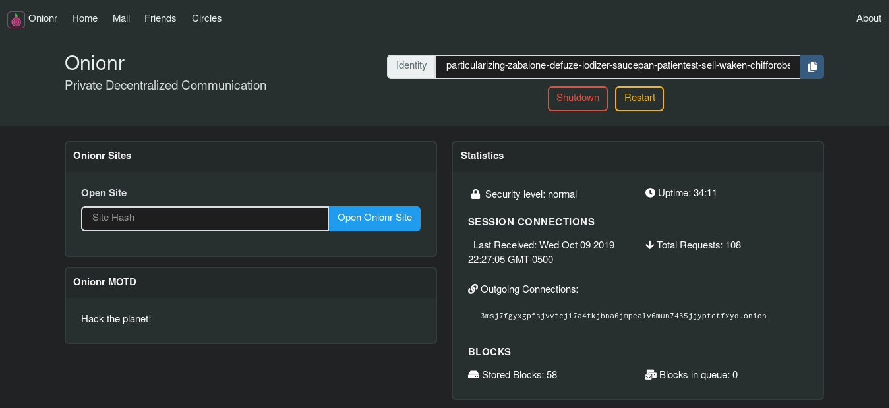
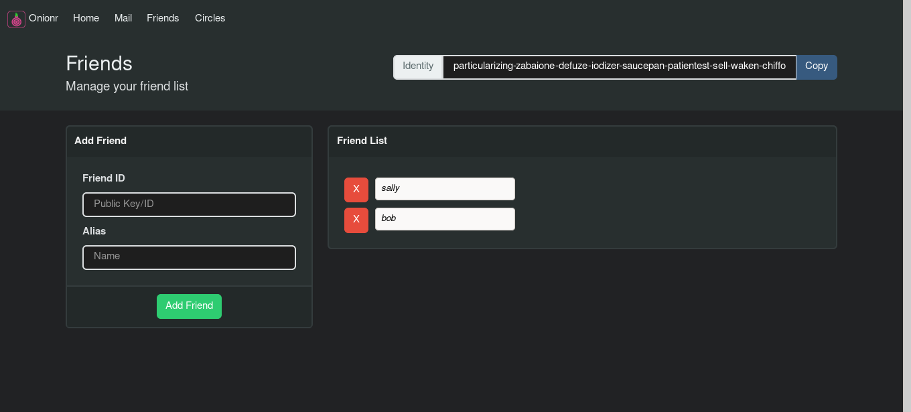
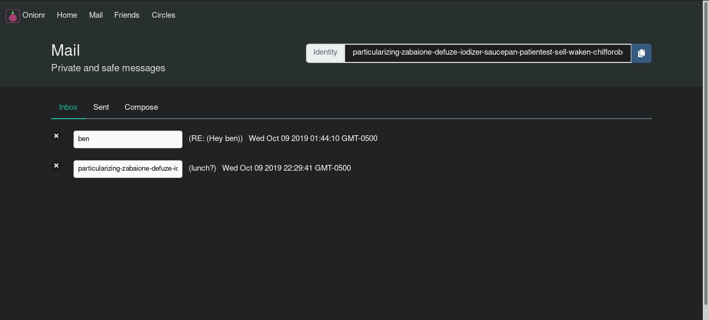

    Privacy Respecting Communication Network 📡

    Anonymous social platform, mail, file sharing.

|                                      |                            |                            |
| -----------                          | -----------                | -----------                |
| [Install](#install-and-run-on-linux) | [Features](#main-features) | [Screenshots](#screenshots)|

Onionr ("Onion Relay") is a decentralized/distributed peer-to-peer communication network, designed to be anonymous and resistant to (meta)data analysis, spam, and corruption.

Onionr stores data in independent packages referred to as 'blocks'. The blocks are distributed to all interested nodes. Blocks and user IDs cannot be easily proven to have been created by a particular user. Even if there is enough evidence to believe that a specific user created a block, nodes still operate behind Tor and as such cannot be trivially unmasked. Anonymity is achieved by a stateless network, with no given indication of what node a block originates from. In fact, since one is not required to participate in routing or storage to insert a message, blocks often do not originate from any identifiable node.

Through message mixing and key privacy, it is intended to be nigh impossible to discover the identity of a message creator or recipient. Via long-term traffic analysis, a well funded adversary may discover the most probable node(s) to be creating a set of related blocks, however doing so would only lead them to a node behind Tor. As the first node that a block appears on is almost always not the creator of the block, there is plausible deniability regarding the true creator of the block.

Onionr gives the individual the ability to speak freely, without fear of surveillance and censorship.

Users are identified by ed25519/curve25519 public keys, which can be used to sign blocks or send encrypted data.

Onionr can be used for mail, as a social network, instant messenger, file sharing software, or for encrypted group discussion.

Due to the nature of anonymity, the graph as implemented in this reference network is dense, undirected, cyclic and can be disconnected. As a result, current scalability is poor but sufficient for high latency communications. As the need arises isolated stream solutions may be implemented (in a manner similar to described in the Bitmessage whitepaper). Since Onionr is technically just a data format, any routing scheme can be used to pass messages.

## Main Features

* [X] 🌐 Fully p2p/decentralized, no trackers or other single points of failure
* [X] 🔒 End to end encryption of user data
* [X] 📢 Optional non-encrypted blocks, useful for blog posts or public file sharing
* [X] 🕵️ Metadata analysis resistance and anonymity

Onionr ships with various application plugins ready for use out of the box:

Currently usable:

* Mail
* Public anonymous chat/message board ( Work in progress)
# Simple webpage hosting - Will be greatly extended
# File sharing (Work in progress)

# Screenshots

Home screen

Friend/contact manager

# Install and Run on Linux

The following applies to Ubuntu Bionic. Other distributions may have different package or command names.

Master may be unstable, you should use the latest release tag. (checkout via git: `$ git checkout release-latest`)

`$ sudo apt install python3-pip python3-dev tor`

* Have python3.7+, python3-pip, Tor (daemon, not browser) installed. python3-dev is recommended.
* You may need build-essentials or the equivalent of your platform
* Clone the git repo: `$ git clone https://gitlab.com/beardog/onionr --tags`
* cd into install direction: `$ cd onionr/`
* Install the Python dependencies ([virtualenv strongly recommended](https://virtualenv.pypa.io/en/stable/userguide/)): `$ pip3 install --require-hashes -r requirements.txt` (on ARM64 devices like Raspberry Pi 4's use requirements-ARM.txt instead.)
* (Optional): Install desktop notification dependencies: `$ pip3 install --require-hashes -r requirements-notifications.txt`

(--require-hashes is intended to prevent exploitation via compromise of PyPi/CA certificates)

## Run Onionr

* Run Onionr normally:  `$ ./onionr.sh start`
* Run Onionr in background as daemon: `$ ./start-daemon.sh`
* Open Onionr web interface  `$ ./onionr.sh openhome`
* Gracefully stop Onionr from CLI `$ ./onionr.sh stop`

# Contact/Community

# Email: beardog [ at ] mailbox.org
# Matrix: #onionr:amorgan.xyz